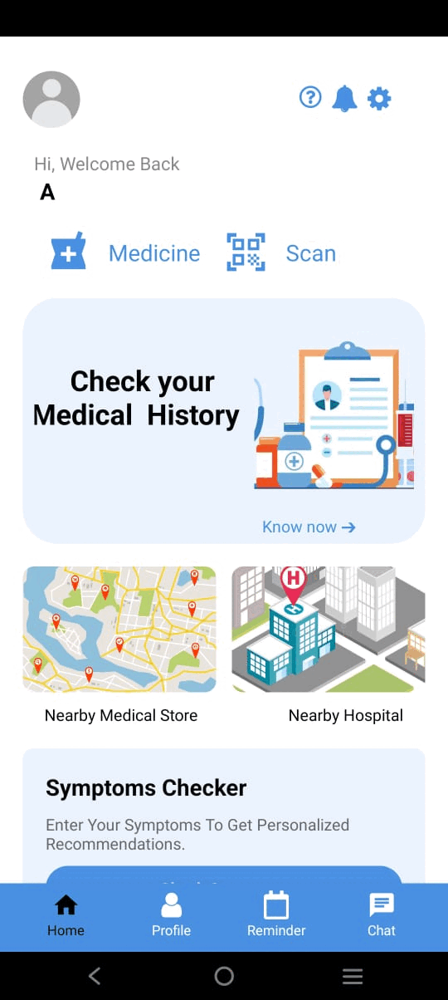

🏥 Med-Tech App

A digital-first healthcare assistant designed to improve the safety, accessibility, and management of medical information. The Med-Tech App empowers users with tools like symptom checking, barcode-based medicine info, AI-powered assistance, reminders, and secure health records — all within a user-friendly mobile application.

✨ Features
🔐 1. Personal Health Management

Secure sign-up and login

Store and access complete medical history anytime

Proactive tracking of past health records

🩺 2. Symptom Self-Assessment

Built-in symptom checker

Get preliminary guidance on health conditions

Helps make informed decisions before visiting a doctor

🤖 3. AI-Powered Medical Support

Integrated AI chatbot for real-time health queries

Provides personalized, medically-informed responses

Acts as your digital health assistant

💊 4. Medicine Information Access

Scan medicine barcodes

View usage, composition, side effects, and safety guidelines

Promotes safe and informed medication usage

⏰ 5. Timely Medication Reminders

Set daily reminders for medications

Reduce missed doses

Improve treatment adherence

📰 6. Health News & Regulatory Updates

Stay informed with real-time health news

Updates on disease outbreaks, drug alerts, and safety tips

Helps users stay proactive about healthcare

👤 7. Personalized User Profiles

Manage health data and preferences

View stored records anytime

Fully customizable user experience

🌍 8. Rural & Remote Healthcare Access

Optimized for low-connectivity areas

Ensures reliable access to health info even offline

📝 9. User Feedback & Continuous Improvement

In-app feedback system for reporting issues & suggesting features

Supports continuous app improvement

🛠️ Tech Stack

Frontend: React Native (Expo)

Backend & Auth: Firebase

AI Integration: Google Gemini API

Database & Storage: Firebase Firestore & Storage

Notifications: Firebase Cloud Messaging

## 📱 App Demo  

✅ Conclusion

The Med-Tech App is a practical and scalable solution for modern healthcare.
By integrating AI, barcode scanning, reminders, and secure health records, it bridges the gap between users and reliable healthcare information. With Firebase-powered real-time sync, authentication, and security, it ensures a seamless and safe experience for all users — including those in rural and remote areas.
